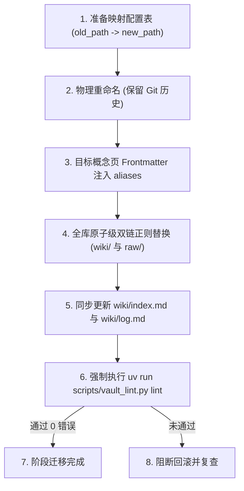

# 概念命名标准化规范与全库迁移实施方案 (Concept Naming Migration Plan)

> **文档状态**：待执行（待用户按批次审阅实施）  
> **更新日期**：2026-09-21  
> **适用目标**：`wiki/concepts/` 概念层命名治理与图谱双链迁移  
> **关联支撑**：`wiki/index.md`、`wiki/log.md`、`scripts/vault_lint.py`、`TODO.md`

---

## 1. 背景与核心价值

### 1.1 现状痛点与背景
在知识库历史构建与持续 Ingest 的过程中，`wiki/concepts/` 概念笔记累计达到 329 篇。由于此前未制定严格统一的“中英文结构与词序规范”，导致概念笔记命名呈现出以下三类典型混合状态：
1. **纯英文命名（69 篇）**：如 `概念_BM25.md`、`概念_LoRA.md`、`概念_DPO.md`、`概念_CRAG.md`、`概念_GQA.md` 等。此类命名在纯中文语境或全局搜索（Quick Switcher）时无法通过中文关键词命中，且单个冷门缩写无法自解释。
2. **中英倒置/混排命名（24+ 篇）**：如 `概念_主成分分析_PCA.md`、`概念_倒排文件索引_IVF.md`、`概念_奇异值分解SVD.md`、`概念_早停EarlyStopping.md` 等。不仅与行业习惯的“缩写前置”心智相悖，而且词序不一致严重影响文件列表排序与可扫描性。
3. **标点与连接符不规范（约 15-20 篇）**：如 `概念_AI-Native_Infra.md`、`概念_AI-ready_data.md`，中横线 `-` 与下划线 `_` 混用，造成正则匹配和跨平台索引解析时的冗余边缘分支。

### 1.2 核心价值与重命名目标
- **文件名自解释（Self-Explanatory）**：达成“英文缩写/专名 + 中文核心释义”的双重视野，一眼即知其技术定位与核心含义。
- **中英双向毫秒级检索（Bi-directional Discovery）**：无论用户输入英文缩写（如 `PCA`）还是中文概念（如 `主成分分析`），均可在 Obsidian 快速定位器或全文检索中精准首位命中。
- **激活未链接提及（Unlinked Mentions）复利效应**：借助标准文件名与 Frontmatter 中的强别名矩阵，Obsidian 可在日常编辑和后续新资料 Ingest 时，自动侦测正文中未打括号的关键词并主动提示双链挂载，最大化知识库复利增长。

---

## 2. 概念命名三分层权威规范

全库 `wiki/concepts/` 目录下所有文件均以 `概念_` 作为物理前缀，采用**下划线 `_` 作为天然语义分界符**，并严格遵循以下三分层规则：

### 规则 1：英文缩写 + 中文核心名（业内通用首字母缩写）
- **适用对象**：具备业内普遍认可、广泛引用的英文字母缩写（如常见算法、技术范式、架构缩写）。
- **标准格式**：`概念_{英文缩写}_{中文核心名}.md`
- **规范要求**：
  - 英文缩写统一采用大写或标准业界大小写（如 `LoRA`、`RLVR`、`DPO`、`BM25`）。
  - 中文核心名简明扼要，反映核心原理或算法本质，控制在 2~6 个汉字，不堆砌冗余修饰词。
- **范例对比**：
  - ✅ `概念_PCA_主成分分析.md` （❌ 避免：`概念_主成分分析_PCA.md` 或 `概念_PCA.md`）
  - ✅ `概念_RLVR_可验证奖励强化学习.md` （❌ 避免：`概念_可验证奖励强化学习.md`）
  - ✅ `概念_LoRA_低秩适应微调.md` （❌ 避免：`概念_LoRA.md`）
  - ✅ `概念_DPO_直接偏好优化.md` （❌ 避免：`概念_DPO.md`）
  - ✅ `概念_GQA_分组查询注意力.md` （❌ 避免：`概念_GQA.md`）
  - ✅ `概念_BM25_最佳匹配25算法.md` （❌ 避免：`概念_BM25.md`）
  - ✅ `概念_IVF_倒排文件索引.md` （❌ 避免：`概念_倒排文件索引_IVF.md`）

### 规则 2：英文专名 + 中文核心名（专有算法 / 复合专有名词）
- **适用对象**：业内无首字母缩写、但以通用英文专属复合词为第一识别特征的技术专有名词。
- **标准格式**：`概念_{英文专名}_{中文释义}.md`
- **规范要求**：
  - 英文专名内部单词以驼峰或下划线连接，保持专有名词的标准拼写。
  - 中文释义精准反映专名涵义。
- **范例对比**：
  - ✅ `概念_FlashAttention_快速注意力.md` （❌ 避免：`概念_FlashAttention.md`）
  - ✅ `概念_Continuous_Batching_连续批处理.md` （❌ 避免：`概念_Continuous_Batching.md`）
  - ✅ `概念_Speculative_Decoding_推测解码.md` （❌ 避免：`概念_Speculative_Decoding.md`）
  - ✅ `概念_Early_Stopping_早停机制.md` （❌ 避免：`概念_早停EarlyStopping.md`）
  - ✅ `概念_Verifiable_Reward_可验证奖励.md`

### 规则 3：原生中文概念（无唯一通用英文对标）
- **适用对象**：由中文语境原创、沉淀的高层方法论、产品思维或业务架构概念，业内无约定俗成的英文对标词汇。
- **标准格式**：`概念_{中文规范名}.md`
- **规范要求**：
  - 专有名词清晰规范，不人为生造无通识基础的英文翻译。
- **范例对比**：
  - ✅ `概念_AI原生思维.md`
  - ✅ `概念_Agent三层记忆体系.md`
  - ✅ `概念_量化.md`
  - ✅ `概念_长文本幻觉.md`

### 2.4 新建前检索查重与知识合并原则（Search-Before-Create）
为保障概念层保持高内聚、避免同义重复与知识碎片化，无论是 Agent 日常 Ingest 还是用户整理笔记，**新建任何概念前必须遵循“检索先行”铁律**：
- **新建前查重检索**：在决定创建新概念前，**必须先通过关键词搜索（Obsidian 全局搜索、`aliases` 别名矩阵检索或 `rg` 全文检索）**，严格确认库内是否已经存在同义、相近或已有雏形的概念页。
- **优先增量扩充与合并**：若库内已存在对应概念（或其同义词、上下位概念），**严禁新建碎片化新页面**！必须直接在既有概念页中增量补充新要点、演进机制或实践总结，并在 Frontmatter `aliases` 中补齐新的中英文别名/缩写，在 `sources:` 中追加来源。
- **严格准入门槛**：只有在确认全库确无同类概念，且严格满足文章核心创新点、具备跨文章通用价值的创建门槛时，才允许按三分层规范新建概念页。

---

## 3. Frontmatter `aliases` 强约束与未链接提及机制

为确保改名后历史检索与未链接提及（Unlinked Mentions）的无缝过渡，每个概念页的 YAML Frontmatter 强制维护 `aliases` 数组。

### 3.1 字段规范定义
概念页 Frontmatter 必须包含以下结构：
```yaml
---
type: "concept"
tags: ["LLM/training", "LLM/finetuning"]
summary: "一句话核心定义"
aliases:
  - "{英文缩写或专名}"
  - "{英文全称（如有）}"
  - "{中文核心名}"
  - "{常用中文简称/俗称}"
  - "{历史旧文件名（若发生更名）}"
sources:
  - "wiki/sources/xxx.md"
updated: "YYYY-MM-DD"
---
```

### 3.2 典型范例解析
以 `概念_LoRA_低秩适应微调.md` 为例：
```yaml
---
type: "concept"
tags: ["LLM/finetuning", "LLM/arch"]
summary: "通过在预训练权重旁路引入低秩分解矩阵实现参数高效微调的方法"
aliases:
  - "LoRA"
  - "Low-Rank Adaptation"
  - "低秩适应微调"
  - "低秩适应"
  - "概念_LoRA"
sources:
  - "wiki/sources/从LoRA到DoRA_参数高效微调全解.md"
updated: "2026-09-21"
---
```

### 3.3 激活机制与收益
1. **Unlinked Mentions 全自动点亮**：当用户在阅读或编写任意笔记时，哪怕只写了 `LoRA`、`低秩适应` 或 `Low-Rank Adaptation`，Obsidian 右侧栏均会自动将其作为“待链接提及”聚类，支持一键转化为双链。
2. **快速检索零盲区**：无论在 Quick Switcher 输入哪个维度的关键词，均能直达该概念页。
3. **历史引用兼容**：即便第三方或旧文档存在旧文件名引用，依然能被全局别名索引平滑解析。

---

## 4. 存量概念全景盘点与分阶段迁移计划

全库 329 篇概念将分为三阶段实施迁移。每次迁移遵循“审查映射清单 $\rightarrow$ 执行原子替换 $\rightarrow$ 运行 Lint 验证”的严格防线。

### 4.1 Phase 1：中英倒置纠偏（优先执行，共 24~28 篇）
- **核心特征**：中文在先、英文缩写或专名在后（或无缝紧贴拼写）。
- **治理策略**：调换词序，将英文缩写/专名提至前置位，补充标准下划线分界符，同时将原中文名写入 `aliases`。
- **清单摘录（部分典型）**：
  1. `概念_主成分分析_PCA.md` $\rightarrow$ `概念_PCA_主成分分析.md`
  2. `概念_倒排文件索引_IVF.md` $\rightarrow$ `概念_IVF_倒排文件索引.md`
  3. `概念_奇异值分解SVD.md` $\rightarrow$ `概念_SVD_奇异值分解.md`
  4. `概念_早停EarlyStopping.md` $\rightarrow$ `概念_Early_Stopping_早停机制.md`
  5. `概念_梯度累积_Gradient_Accumulation.md` $\rightarrow$ `概念_Gradient_Accumulation_梯度累积.md`
  6. `概念_分位数回归与Pinball_Loss.md` $\rightarrow$ `概念_Pinball_Loss_分位数回归.md`
  7. `概念_固定内存_Memory_Pinning.md` $\rightarrow$ `概念_Memory_Pinning_固定内存.md`
  8. `概念_状态空间模型SSM.md` $\rightarrow$ `概念_SSM_状态空间模型.md`
  9. `概念_状态空间对偶SSD.md` $\rightarrow$ `概念_SSD_状态空间对偶.md`
  10. `概念_线性时不变LTI.md` $\rightarrow$ `概念_LTI_线性时不变.md`
  11. `概念_接地气Groundedness.md` $\rightarrow$ `概念_Groundedness_事实接地性.md`
  12. `概念_重排序Rerank.md` $\rightarrow$ `概念_Rerank_重排序.md`
  13. `概念_解耦式KV缓存与LMCache.md` $\rightarrow$ `概念_LMCache_解耦式KV缓存.md`

### 4.2 Phase 2：纯英文补全核心中文（重点攻坚，共 69 篇）
- **核心特征**：文件名仅有英文字母或缩写，缺少中文释义。
- **治理策略**：根据概念内容提炼核心中文名，生成 `概念_{英文}_{中文}.md`，原英文及全称自动注入 `aliases`。
- **清单摘录（部分典型）**：
  1. `概念_BM25.md` $\rightarrow$ `概念_BM25_最佳匹配25算法.md`
  2. `概念_LoRA.md` $\rightarrow$ `概念_LoRA_低秩适应微调.md`
  3. `概念_DPO.md` $\rightarrow$ `概念_DPO_直接偏好优化.md`
  4. `概念_GQA.md` $\rightarrow$ `概念_GQA_分组查询注意力.md`
  5. `概念_CRAG.md` $\rightarrow$ `概念_CRAG_纠正性检索增强生成.md`
  6. `概念_DSPy.md` $\rightarrow$ `概念_DSPy_声明式提示词编译框架.md`
  7. `概念_KAN.md` $\rightarrow$ `概念_KAN_柯尔莫哥洛夫阿诺德网络.md`
  8. `概念_MHA.md` $\rightarrow$ `概念_MHA_多头注意力.md`
  9. `概念_MQA.md` $\rightarrow$ `概念_MQA_多查询注意力.md`
  10. `概念_MLA.md` $\rightarrow$ `概念_MLA_多头潜在注意力.md`
  11. `概念_PPO.md` $\rightarrow$ `概念_PPO_近端策略优化.md`
  12. `概念_RLHF.md` $\rightarrow$ `概念_RLHF_人类反馈强化学习.md`
  13. `概念_SFT.md` $\rightarrow$ `概念_SFT_监督微调.md`
  14. `概念_Self-RAG.md` $\rightarrow$ `概念_Self_RAG_自省式检索增强生成.md`
  15. `概念_FlashAttention.md` $\rightarrow$ `概念_FlashAttention_快速注意力.md`
  16. `概念_vLLM.md` $\rightarrow$ `概念_vLLM_高吞吐推理引擎.md`

### 4.3 Phase 3：标点与分界符标准化（约 15~20 篇）
- **核心特征**：连字符 `-`、空格或非法字符混用。
- **治理策略**：将文件名中的 `-`（非业内专有固定词如 `AI-Native`）和空格统一替换为标准下划线 `_`，确保解析规则纯净。

---

## 5. 自动化重命名与原子替换技术方案 (SOP)

为杜绝任何重命名带来的死链、索引丢失或元数据破损风险，必须采用**确定性 Python 脚本工具**配合全库原子替换流程。



### 5.1 实施标准操作程序 (SOP)
1. **构建映射表与人工审查**：
   编写迁移批次配置文件（如 `tmp/concept_migration_batch_p1.json`），列出本批次所有待修改概念的 `old_stem`、`new_stem`、`injected_aliases`。由用户核准通过后方可执行。
2. **Git 物理重命名**：
   使用文件系统或 `git mv` 移动 `wiki/concepts/{old_stem}.md` $\rightarrow$ `wiki/concepts/{new_stem}.md`，确保 Git 保留提交历史轨迹。
3. **概念页 Frontmatter 自动回填**：
   自动读取目标文件 YAML，将 `old_stem`、相关中英文缩写安全去重写入 `aliases` 字段，并同步将 `updated` 刷新为当前日期。
4. **全库双链精准原子替换**：
   全量遍历全库 Markdown 文档（包括 `wiki/` 所有子目录与 `raw/` 物理文献正文），使用正则表达式精准替换所有双链格式：
   - 格式 A：`[[concepts/{old_stem}]]` $\rightarrow$ `[[concepts/{new_stem}]]`
   - 格式 B：`[[concepts/{old_stem}|{alias}]]` $\rightarrow$ `[[concepts/{new_stem}|{alias}]]`
   - 格式 C：`[[{old_stem}]]` $\rightarrow$ `[[{new_stem}]]`
   - 格式 D：`[[{old_stem}|{alias}]]` $\rightarrow$ `[[{new_stem}|{alias}]]`
   *注：严格使用边界匹配与双括号限制，严防正文普通词汇误伤。*
5. **总索引与流水日志同步**：
   - 更新 `wiki/index.md`：同步修改对应行下的显示文本与文件名。
   - 追加 `wiki/log.md`：记录结构化迁移日志，如：
     `## [YYYY-MM-DD] refactor | 概念命名标准化迁移 (Phase 1): {old} -> {new} (+ affected pages)`
6. **全库健康门禁审计**：
   每次批次操作完成后，必须运行：
   ```bash
   uv run scripts/vault_lint.py lint
   ```
   验证：
   - 检查 0：YAML Schema 与来源链 100% 合规
   - 检查 1：`wiki/index.md` 挂载率 100%
   - 检查 2：全库死链数为 0
   只有全部检查项均呈现绿色通过，该批次迁移才宣告成功。

---

## 6. 验收标准与成功度量

| 验收维度 | 指标与合格基线 | 验证方式 |
|---|---|---|
| **命名合规性** | 目标批次概念文件 100% 遵循 `概念_{英文}_{中文}.md` 或规则 3 | 规则检查器扫描 |
| **双链完整度** | 全库 0 个失效双链引用（Broken Links = 0） | `vault_lint` 检查 2 |
| **索引一致性** | 目标概念在 `wiki/index.md` 中 100% 正确映射无遗漏 | `vault_lint` 检查 1 |
| **别名覆盖率** | 目标概念 Frontmatter `aliases` 字段 100% 填充缩写与旧名称 | 属性审计脚本 |
| **图谱健康度** | 全库 YAML Frontmatter 格式安全，来源链无越级断链 | `vault_lint` 检查 0 |
