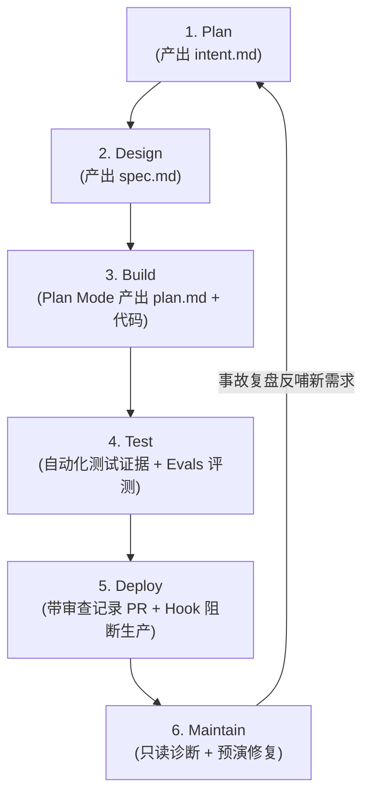

# 概念：AI-Native SDLC

## 定义与背景

**AI-Native SDLC（AI 原生软件开发生命周期）** 是由 [[entities/实体_Anthropic|Anthropic]] 提出的面向 AI 编程时代的新型工程方法论。

在传统软件工程中，规划（Plan）、设计（Design）、构建（Build）、测试（Test）、部署（Deploy）、维护（Maintain）这六个阶段基于一个核心假设：**“写代码（Build）是最耗时、成本最高的环节”**。围绕该假设，行业建立了厚重的评审会、PRD 和代码审查流程。

随着 AI 编程工具的大规模应用，代码生成速度提升了数倍至数十倍，使得瓶颈从“写代码的速度”剧烈转向“上下游协同与验证效率”。AI-Native SDLC 的核心目标是将传统单向线性开发流水线，重组为由受版本控制产物所驱动的**闭环自转循环（The Loop）**，并设立确定性的多层规则防御体系。

---

## 核心机制：六阶段产物驱动闭环（The Loop）

每个阶段生成强类型、版本控制的 Markdown 文档，作为下一阶段的自动输入，并供人类审计：

1. **Plan（规划）**：通过与 AI 结构化对话厘清业务目标，AI 扮演分析师进行严谨追问，输出 `intent.md`（明确目标、用户画像、核心约束以及显式不做的 Non-goals）。
2. **Design（设计）**：AI 结合 `intent.md` 与组织级规范（Skills），输出施工图级别的 `spec.md`（详细描述接口交互、数据流、系统变动与合规红线）。
3. **Build（构建）**：强制推行计划模式（Plan Mode）。AI 深入代码库分析改动范围与验证方案，与开发者反复打磨至满意并落盘为 `plan.md`。**计划未经批准，严禁生成或修改业务代码**。
4. **Test（测试）**：不轻信 AI 的“已完成”声明，以可重现的自动化测试运行记录与截屏为准。引入无历史偏见的独立新会话复核代码，并借助 Hook 禁止 AI 篡改测试用例。设立 Evals 回归评测集，防范模型升级或规则变更引发能力退化。
5. **Deploy（部署）**：AI 依据 `REVIEW.md` 规范执行代码自查并提交流水线。开发环境支持自动化交付，但生产环境上线指令必须由 Hook 强力拦截，直至具名人类审批人显式授权。
6. **Maintain（维护）**：线上监控触发受限的只读诊断 Agent（只查不改），评估异常并调用预演脚本排障。线上事故复盘沉淀为新的 `intent.md`，推动循环持续自转。

---

## 三层规则防护体系（Three-Layer Guardrails）

AI-Native SDLC 明确区分指导性规范与确定性门禁，构建三层同心圆防御：

| 层级 | 载体 | 适用场景 | 属性与约束力 |
| :--- | :--- | :--- | :--- |
| **基础层 (Baseline)** | `CLAUDE.md` | 工程全局根目录指南：架构说明、测试启动命令、避坑清单 | 指导性（会话初始化必读） |
| **规范层 (Procedures)** | `Skill` | 特定业务场景的操作规范：如接口鉴权、特定数据迁移规程 | 指导性（垂直模块按需加载） |
| **门禁层 (Guardrails)** | `Hook` | 绑定关键操作的自动化执行脚本：保护关键文件、阻断敏感凭证外泄、拦截发布 | **强制性（确定性硬拦截，违规立即中断）** |

---

## 五层落地成熟度阶梯（5-Layer Adoption Roadmap）

企业落地无需一步到位，可按依赖关系递进实施：
- **L1 基础防线**：直接落地 `intent.md`、`CLAUDE.md`、自动化测试反馈、发布拦截 Hook 与 Plan Mode。
- **L2 规范固化**：针对重复高频任务沉淀 Skills，针对复杂任务启用 Subagents 隔离上下文，建立回归 Evals。
- **L3 审查集成**：将 AI 接入需方 Design 流程，基于规范自动执行 PR 预审。
- **L4 CI/CD 贯通**：打通代码审查与自动化交付流水线，由 Hook 守住发布权限。
- **L5 线上自愈**：接入线上可观测性体系，异常自动唤醒诊断 Agent 并自动生成新需求闭环。

---

## 范式转变与人类角色定位

1. **组织资产版本化**：团队工程文化与隐性知识从“个人记忆与零散 Wiki”转变为“随代码仓库版本控制的 `CLAUDE.md`、Skills 与 Hooks 源码资产”。
2. **人在回路（HITL）的高阶位移**：人类工程师从逐行挑错的“代码打字员与语法审查员”，升级为定义核心问题、权衡系统性架构风险、把控发布权限的“战略裁决者”。

---

## 关联实体 / 概念

- **关联实体**：
  - [[entities/实体_Anthropic|实体_Anthropic]]
  - [[entities/实体_Claude_Code|实体_Claude_Code]]
- **关联概念**：
  - [[concepts/概念_CLAUDE.md最佳实践|概念_CLAUDE.md最佳实践]]
  - [[concepts/概念_Claude_Code多智能体协同机制|概念_Claude_Code多智能体协同机制]]
  - [[concepts/概念_HITL_MCP|概念_HITL_MCP]]

---

> 📎 **来源摘要**：[[wiki/sources/Anthropic 重磅发布：AI Native 软件开发方法论.md]]
