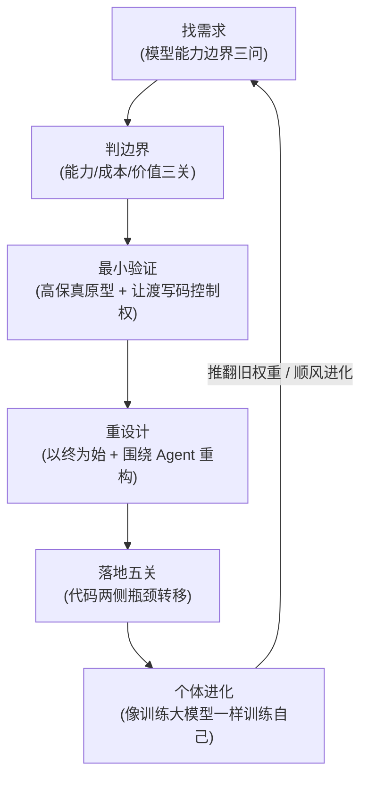

# 概念：AI 原生思维（AI-Native Thinking）

## 定义与核心内涵

**AI 原生思维（AI-Native Thinking）** 是指在以大模型与自主智能体（Agent）为核心驱动的技术范式下，彻底打破传统“让 AI 机械模仿人类既有分工与线性工序”的惯性，**以终为始**，围绕模型的能力特征、成本结构与交互形态，重新审视产品需求、系统架构、工程链路以及个体成长方式的系统化方法论。

该方法论主张：真正的创新不在于给旧框架打补丁，而在于顺应模型进化顺风，敢于推翻旧权重，将软件系统设计和个人能力进化构建为自收敛的持续循环。

---

## 核心维度与方法论体系

### 1. 找需求：紧盯模型能力的边界线
- **机会诞生于边界**：需求始终存在，但只有当大模型能力的边界线刚好扫过该需求时，产品才能从繁琐低效的实验室探索跃迁为体验优秀的普及型应用（如 Nano Banana 提示词在 Gemini 具备原生联网搜索后才爆发）；
- **立项三问**：① 痛点够不够硬；② 自己是不是高频真实用户（只有天天用才能获得最灵敏的痛感和闭环反馈）；③ AI 的能力是否刚好能触达。

### 2. 判边界：能力、成本与价值的三关过滤
- **能力边界（动态）**：同一个通用 Agent 想法，在 2023 年（AutoGPT）因模型长程能力不足而陷入无限死循环，而在 2025 年（Manus）能力跨过临界点后得以爆发。开发准则是“搭架子等模型”：现在能做的立刻做，半年内能做好的搭好架构静待顺风，长期无法突破的由工程兜底或果断放弃；
- **成本边界（动态）**：Token 单价下降但 Agent 模式总调用量成倍放大。通过格式取舍实现降本：让模型输出其最擅长的纯文本或 HTML，将复杂 Diff 与对齐计算下放给确定性程序，避免大模型生成庞大冗余的结构化 JSON；
- **价值边界（静态）**：锚定在人性深处，明确用户买的是“确定性输出”还是“背后的情感与人格”。避免低水平复制制造“AI 垃圾”。

### 3. 最小验证：高保真原型与非舒适区突破
- **让坏想法死得早**：利用 Claude Design 等 AI 原型能力直接生成带模拟数据的高保真可交互界面，将原本数周的开发反馈周期压缩至数小时，在极低成本下证伪伪需求；
- **非舒适区技术选型**：使用开发者不熟练的语言或框架（如熟悉 TS 的工程师采用 Swift/AppKit），能有效抑制开发者“总想亲手控制每一行代码细节”的旧习惯，逼迫开发者将写码全权交由 Agent，自身彻底退居为方案定义者与质量把关者。

### 4. 重设计：打破模仿人类的路径依赖
- **以终为始连环追问**：不再按照人类分工线性切分任务（例如字幕组从听写到切 SRT、翻译、对齐的琐碎工序），而是利用底层基础能力（如 Whisper 词级时间戳）在语义完整句子层直接对齐，反向重算时间轴；
- **让 Agent 操作其擅长的格式**：优先使用 HTML、Markdown 和普通文本，贴合大模型海量训练语料；
- **给规范（Design System）不给模板**：遵循“苦涩的教训”，向 Agent 灌输颜色、排版与栅格设计规范，由其动态编排，随着模型智能提升产物自动变强；
- **将应用降级为 Agent 插件**：用户流量入口已向 Agent 对话流迁移，软件自身的 GUI 界面退化为可选项，核心功能沉淀为可被 Agent 调用的命令行与 API 插件。

### 5. 软件工程两侧瓶颈与落地五关
在“可行性分析 → 设计文档 → 高保真原型 → 渐进实现 → 验收测试”链条中：
- **代码两侧成为绝对瓶颈**：Agent 能在数小时内完成代码编写，传统工程瓶颈彻底转向**左侧设计定义**（清晰的目标、PRD 文档与原型确认）与**右侧测试验收**（黑盒质量把关）；
- **文档是一等公民**：设计文档是人类最低成本的方案对齐工具，也是智能体在跨会话执行时传递上下文的不可替代接力棒；
- **验证题给 Agent，判断题留给人**：功能回归由 Agent 运行脚本自主闭环，人类专注裁决方向正确性与体验品味。

### 6. 个体共同进化：像训练大模型一样推翻旧权重
- **双层自收敛循环（Loop Engineering）**：小循环做项目快速拿结果并验收，大循环做总结与公开分享，借助外部真实反馈倒逼认知升级；
- **敢于推翻旧权重**：模型历经预训练、微调与强化对齐持续迭代，个人也必须保持知识架构的动态更新，敢于废弃过时的技术偏见；
- **刻意练习验收“品味”（Taste）**：代码实现细节可黑盒化对待，人类的终极壁垒是对产物优劣的鉴赏力，必须通过海量输入与亲身实操进行类似大模型微调的数据沉淀。

---

## 关联

- [[concepts/概念_AI_Native_SDLC_AI原生软件开发生命周期]]
- [[concepts/概念_CLAUDE.md最佳实践]]
- [[concepts/概念_Agent系统化工程]]
- [[entities/实体_宝玉]]
