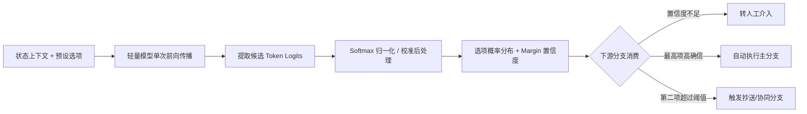

# 概念：Decision Model (专用判断模型)

## 1. 概念定义与核心定位

**专用判断模型（Decision Model）**，在工业界亦常被称为“第一系统模型（System 1 Model）”或“选项概率接口（Choice API）”，是一种**完全不生成自回归自然语言文本、仅输出候选选项概率分布与整体置信度**的模型服务或本地运行形态。

在现代智能体（AI Agent）系统架构中，它承担“流水线单步裁判”职责。传统的做法是让擅长长文本生成的通用大模型（如通过复杂的思考链 CoT）去做出分支决策或工具调用前置校验，往往造成秒级交互延迟与高昂的 Token 费用；而判断模型将“做出选择”与“生成文本”在计算层彻底解耦，使确定性单步选择的耗时与成本被压缩到毫秒与微美分级别。

---

## 2. 底层机制与概率消费模式

1. **Logits 直接提取与归一化**：
   - 模型在接收到输入 prompt 与候选标签后，仅执行单次前向计算（Forward Pass），直接在词表对应 token 处读取未归一化的原始输出分数（Logits），并通过 Softmax 转化为概率分布。
   - 避免了自回归采样（Autoregressive Sampling）带来的逐 Token 循环计算与长文本填充。
2. **分布形状（Shape）与置信裕度（Margin）**：
   - 传统硬分类器仅给出单一标签或 Argmax 胜者，而判断模型输出完整的概率分布向量；
   - 关键指标不仅包括各项概率，还包括胜者与第二名的差值或形状指标（Margin），反映模型对当前判定的真实确信程度，留存“两可”的真实语义。
3. **概率校准（Calibration）**：
   - 原始提取的概率若存在过度自信，可通过标准的后处理技术（如 [[concepts/概念_分类模型校准|Platt 缩放]] 或温度缩放 Temperature Scaling）将输出对齐到实际频率空间。

---

## 3. 判断 API 的五次演进浪潮

将判断能力从生成模型中剥离成独立服务，工业界在过去十年中经历了五轮演进循环：

| 浪潮与时间 | 代表系统 / 接口 | 核心特性 | 历史受阻原因与局限 |
| :--- | :--- | :--- | :--- |
| **第一轮 (2017)** | Alphabet / Jigsaw 的 Perspective API | 输入留言返回毒性评分，日处理 5 亿次请求 | 分类类目固定在安全审核，无法运行时动态自定义选项 |
| **第二轮 (2021)** | [[entities/实体_OpenAI|OpenAI]] 的 `/classifications` 端点 | 允许通过少样本做标签分类与判定 | 2022 年官方主动下线，大厂认为通用生成更灵活 |
| **第三轮 (2022)** | Cohere 的 Classify API | 输入文本与候选标签返回置信度分布 | 需每标签提供少样本，依赖上一代嵌入模型，2025 年进入半退役 |
| **第四轮 (2025)** | fastino 的 GLiNER2 | 单次前向同时实现零样本动态分类、实体识别与提取 | 受限于 512 tokens 输入长度，缺少下游 Agent 应用带动，未出圈 |
| **第五轮 (2026)** | TypeSafe 的 [[entities/实体_Jev|Jev]]、开源 [[entities/实体_Laya|Laya]] (421M) 与本地 Logits 提取方案 | 零样本、数十至百毫秒级确定性分布输出，基于 RLCD 强化学习严格校准，深度融入 Agent 基础设施 | 伴随 Agent 长调用链高频路由需求爆发，从闭源 API 快速向端侧开源高吞吐演进 |

---

## 4. 智能体系统架构分工与选型原则

在智能体（如 GUI 操作、浏览器自动化或复杂业务 Agent）中，端到端执行的高效性源于三阶段分工：

1. **前端感知（Perception）**：由原生程序负责（如本地解析 DOM 结构，整理为简洁带编号的控件列表，或采用 [[concepts/概念_WebMCP_浏览器原生工具协议|WebMCP]] 协议），消除大模型处理全屏截图的沉重计算；
2. **逻辑判断（Decision）**：由轻量判断模型（或本地 0.8B 小模型提取 Logits）根据感知表征选择目标控件编号与动作，单步耗时控制在数十至百毫秒内（如本地 0.8B 模型约 71 ms）；
3. **终端执行（Action）**：由宿主系统原生代码驱动模拟点击与工具调用。

### 系统选型权衡矩阵

- **内部高频密集流转（工单路由、状态机跳转、工具调用前置拦截）**：
  - 首选**本地小模型提取 Logits**（如 0.8B Qwen 配合 WebGPU），单步约 71 ms，零网络 RTT，直接读取 Logits 在数学上具备完全确定性，零边际调用成本。
- **复杂长程推理与开放生成**：
  - 必须交给**成熟的通用前沿大语言模型**（如 Claude、GPT 系列），不可由判断模型越权承担生成。
- **静态固定标签且样本充足场景**：
  - 首选**传统专用分类器**（在钓鱼邮件测试中准确率 81.3%，明显优于零样本判断模型的 62.6%）。

---

## 5. 关联概念与实体

- **核心实体**：
  - [[entities/实体_Laya|实体_Laya]]：421M Apache 2.0 开源 System 1 决策模型，33ms 极低延迟与严格概率校准。
  - [[entities/实体_Jev|实体_Jev]]：商业化云端判断模型接口代表。
  - [[entities/实体_Claude_Code|实体_Claude_Code]]、[[entities/实体_Codex|实体_Codex]]：内部深度集成工具命令拦截与前置分类步的 Agent。
  - [[entities/实体_LangChain|实体_LangChain]]：集成判断模型开发开源安全与路由中间件。
- **核心概念**：
  - [[concepts/概念_RLCD校准决策强化学习|概念_RLCD校准决策强化学习]]：采用严格适当评分规则复合奖励与策略梯度的强化学习决策校准范式。
  - [[concepts/概念_分类模型校准|概念_分类模型校准]]：Platt 缩放与温度缩放校准概率分布。
  - [[concepts/概念_LLM模型路由|概念_LLM模型路由]]：基于分类判断进行动态请求与模型分流。
  - [[concepts/概念_WebMCP_浏览器原生工具协议|概念_WebMCP_浏览器原生工具协议]]：UI Agent 中前端感知表征优化的关键协议。

---

## 6. 支撑来源

- [[wiki/sources/更好的替代品早已存在，Jev 留给研究的只剩时机|更好的替代品早已存在，Jev 留给研究的只剩时机]]
- [[wiki/sources/Laya开源_421M参数33毫秒System1决策|Laya 开源：比Jev快4倍！421M 参数，33 毫秒完成 System 1 决策]]
