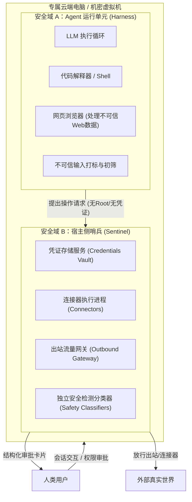

# 概念：Personal Agent (个人智能体)

## 1. 概念定义与核心范式跃迁

**个人智能体（Personal Agent）**，亦被称为**个人超级智能（Personal Superintelligence）**，代表了智能体系统从传统的“单轮被动问答”（Q&A Chatbot）向“长程在线、替用户主动办事”（Proactive, Always-On Task Execution）的根本范式跃迁。

与专注于企业级垂直场景或特定编码流的智能体（如专注于代码仓库协同的 [[entities/实体_Claude_Code|Claude Code]]）不同，个人智能体直接面向个体的日常生活、家庭关系、财务管理与日程统筹，必须在以下三组核心矛盾之间建立精妙平衡：
1. **主动推进 vs 避免侵扰**：具备自主推进任务的能力，但必须设立极高通知门槛，杜绝沦为不断推送无意义弹窗的应用；
2. **动手执行 vs 权限失控**：能够操控浏览器、终端与服务连接器真切替用户办事，但在不可撤销操作前必须停步获取确定性授权；
3. **全局记忆 vs 隐私安全**：深度了解用户的日程、邮箱、健康、财务与家庭偏好，但必须通过不可绕过的系统架构让用户安心授权。

---

## 2. 交互形态三要素：超越“一切皆 Chat”

在用户体验与交互架构上，个人智能体突破了对话框文本流的局限：

1. **单会长对话（Single Continuous Conversation）与侧边上下文隔离**：
   - 交互界面主干维系为一段持续长对话，跨越数周乃至数月，如同与真实伙伴交流；
   - 支持多任务并发下随时打断或连续派发；
   - 针对长流程复杂专题（如旅行规划、课程设计），引入**侧边对话（Side Conversations）**实现上下文按需解耦隔离；
   - 借助聊天气泡明确界定交替想法的起点与终点。
2. **富交互产物（Tailored Interactive Artifacts）**：
   - 大语言模型输出一大段两千字文本往往非用户所欲（例如让 Agent 规划行程需要的是结构化行程表，追踪开支需要的是动态仪表盘）；
   - 结合 [[concepts/概念_Presentation_Tools_表现层工具化|表现层工具化 (Presentation Tools)]]，由 Agent 动态构建富文本、交互式卡片、可操作表单与微型 Web UI 嵌入对话流。
3. **拟人形象定制与透明度中枢**：
   - 允许用户为 Agent 赋予专属名字、外形形象与风格特征，提升长期共处心理认同；
   - 提供直观的活动说明、历史执行轨迹以及独立的**「目标」标签页（Goals Tab）**，实时呈现 Agent 正在后台追踪的待办项目与演进步骤，消除后台不可见带来的信任黑盒。

---

## 3. 双安全域隔离架构（Dual Security Domain Architecture）

将个人邮箱、系统 Shell 与支付渠道交由自主软件运行，会直接面临 Simon Willison 提出的**「致命三要素」（Lethal Trifecta）**威胁——即同时具备：① 访问私密数据、② 接触不可信外部内容、③ 能够对外发起通信。若防护不当，提示词注入即可将个人私密数据经由外部信道窃取。

以 [[entities/实体_Muse|Muse]] 为代表的现代个人智能体采用**双安全域物理/逻辑强隔离架构**：

- **安全域 A（Agent 运行单元 / Harness）**：运行在独立的隔离沙盒中，负责驱动模型推理与任务执行。其特点是**预设正在遭受攻击**，所有来自外部的数据（网页、邮件等）均被自动标记为不可信输入；该域**完全看不到真实用户凭证，且不拥有宿主机 Root 权限**。
- **安全域 B（宿主侧哨兵 / Sentinel）**：与主 Agent 物理分离的独立宿主服务。作为所有连接器操作与网络出站流量的**唯一权威审批方**。安全检查模型、凭证库与出站网关均置于哨兵域内，运行单元无法通过任何指令将其关闭或绕过。

### 结构化 Human-in-the-Loop 与权限收敛
- **结构化审批卡片**：在写信、外发信息、付费等关键节点渲染带清晰「接受 / 拒绝」的独立 UI 控件，杜绝口头对话式模糊授权；
- **防范横幅盲视（Banner Blindness）**：只读操作与低风险探索静默放行，只对真正不可撤销（Irreversible）的操作设置拦截阻力；
- **连接器细粒度脱敏**：
  - **邮件连接器**：通过确定性规则与分类模型自动过滤一次性短信验证码（OTP）、密码重置链接与免密登录 Token，防止攻击者接管第三方账户；
  - **支付隔离**：使用一次性虚拟卡号（限制商户、金额与时效），阻断注入窃取。

---

## 4. 记忆工程演进与“分寸感”（Discretion）

个人智能体的记忆必须兼具长期性和高度敏感性：

1. **夜里学习（Nightly Learning）**：
   - 摆脱在白天的交互主循环中频繁写入记忆带来的注意力争抢；
   - 系统利用夜间空闲周期自动回溯全天对话轨迹与任务结果，提炼反思并归纳沉淀至长期记忆库，同时自主演进未完成的目标清单并衍生新提议。
2. **记忆透明度与用户自决**：
   - 用户的记忆文件（Memory Files）完全向用户开放，支持随时直接阅读、校正与物理删除，保障知情权与合规性。
3. **“分寸感”作为核心受训能力**：
   - 个人超级智能必须在预训练与后训练阶段专门注入对信息敏感度的辨识能力；
   - 对内了解用户全部隐私（如健康状况、家庭偏好），对外代表用户办事（如预订餐厅）时，必须自主决策隐藏不必要的私密信息，在达成目标的同时坚决守住隐私边界。

---

## 5. 关联概念与实体

- **核心实体**：
  - [[entities/实体_Muse|实体_Muse]]：Meta 推出的个人智能体旗舰产品
  - [[entities/实体_Meta|实体_Meta]]：推动个人智能体与机密虚拟机研发的核心机构
  - [[entities/实体_Claude_Code|实体_Claude_Code]]：企业代码工程领域的协同智能体代表（与 Personal Agent 形成互补）
- **核心概念**：
  - [[concepts/概念_Presentation_Tools_表现层工具化|概念_Presentation_Tools_表现层工具化]]：生成丰富交互卡片与微界面的技术底座
  - [[concepts/概念_Agent三层记忆体系|概念_Agent三层记忆体系]]：个人智能体长期记忆与夜里学习的基础框架
  - [[concepts/概念_Hardened_Sandbox_强化隔离沙盒|概念_Hardened_Sandbox_强化隔离沙盒]]：双安全域隔离与沙盒运行基础
  - [[concepts/概念_HITL_MCP_人机协同协议架构|概念_HITL_MCP_人机协同协议架构]]：结构化人机协同与权限审批机制

---

## 6. 支撑来源

- [[wiki/sources/Meta复盘Muse_Agent怎么才能像一个人长期存在.md]]
