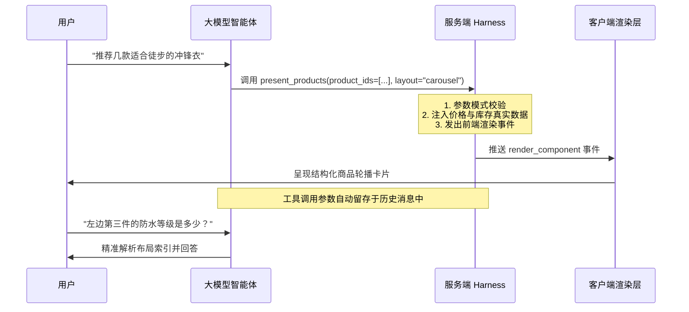

# 概念：表现层工具化（Presentation Tools）

## 定义与背景

**表现层工具化（Presentation Tools as UI Components）** 是一种将前端富交互界面组件（如商品轮播、行程卡片、对比图表、座席地图）建模为智能体强类型工具调用的设计范式。

在早期的 AI 应用与智能体交互中，团队通常采用在系统提示词中约定自定义标记（如 `<carousel>`、`<card>`）或内嵌 Markdown/HTML 标签的方式，由客户端进行语法解析并渲染。但在长程与复杂业务场景下，这种方法暴露出严重的结构性缺陷：
1. **结构脆弱与幻觉失控**：大模型对自定义标记的遵循能力远弱于基于函数调用的 Tool Use，面对嵌套结构时频繁出现闭合缺失或非法格式；
2. **上下文膨胀与回归风险**：每新增或调整一个 UI 组件，都需要在系统提示词中增加详尽的格式规范，导致上下文持续膨胀，并容易引发对其他提示词指令的注意力退化；
3. **会话历史断代与不可重用**：持久化的对话记录包含私有解析标记，后续会话加载或向模型原生 API 回放历史时，无法被模型原生理解与复用。

因此，工业级智能体架构将 UI 组件全面升格为标准的 Tool 调用（如 `present_products`、`present_itinerary`、`present_plan_comparison`）。

---

## 核心机制与优势

### 1. 结构确定性与事件驱动渲染
模型仅输出符合 JSON Schema 的强类型调用参数（例如列表 ID、排列顺序、高亮标签），不直接生成像素与 HTML 结构。服务端接收到调用请求后执行两项确定性动作：
- **严格校验与防伪造**：拦截非法的参数或越权 ID；
- **业务数据注入（Data Hydration）**：服务端从底层数据库中拉取最新的价格、库存、正版标题与核验文案，填充入组件中，并将组装好的结构化数据作为前端事件推送给客户端渲染。

### 2. 屏幕布局反向感知（Screen Layout Context）
这是表现层工具化最具价值的衍生能力。
在传统的文本渲染模式下，模型无法知晓客户端最终将内容呈现为几行几列。而在表现层工具规范下，**工具调用的参数天然作为原生消息持久化在会话上下文（Messages Array）中**。
如果模型调用的参数结构严格按照渲染布局设计（例如按行组织的卡片或有序轮播数组），当用户在后续轮次中提出指代性需求（如“第一个酒店”、“左起第三个商品”、“对比图里的第二项”）时，模型能够直接在上一轮工具调用的入参中精准定位目标实体，彻底解决界面交互与语言模型推理脱节的问题。

### 3. 数据安全与合规文案锁定
在金融、电商及合规敏感场景下，费用说明、免责条款和退改规则受到严格法律监管。
通过 Presentation Tools，模型仅负责决定“在何时向用户展示哪类规则”，而具体的合规文本完全由服务端根据业务模板逐字节填入。模型无法对合规声明进行自由发挥或语义篡改，评测系统亦可对渲染输出进行确定性的字节级比对。

---

## 性能权衡与流式渲染优化

| 机制 | 运行逻辑 | 优势 | 适用场景 |
| :--- | :--- | :--- | :--- |
| **标准服务端缓冲验证** | 服务端等待工具调用的顶层 JSON 参数接收完毕后，完成校验再推向前端 | 100% 格式确定性，杜绝前端白屏崩溃 | 结账确认、金额支付、合规合同签署 |
| **急切输入流式（Eager Input Streaming）** | 智能体在生成工具参数的同时，将 Token 级别的分片实时流式推送至前端 | 极大压缩感知延迟，避免数秒转圈等待 | 商品卡片、推荐列表、搜索结果等消费级浏览界面 |

在消费级界面中，一个典型的富组件输出约为 500~700 tokens。若采用全量缓冲校验，用户往往面临长达 3~5 秒的空白转圈等待，严重加剧交易摩擦。因此，在 Claude 3.5/3.7 等强基座模型上，通常配置 `eager_input_streaming: true`，结合前端渐进式骨架屏渲染；针对极低概率出现的格式微小畸变，在 Harness 外围包裹轻量级自动重试即可达到极高可靠性。

---

## 关联

- [[concepts/概念_电商智能体架构]]
- [[concepts/概念_上下文工程]]
- [[concepts/概念_Agent系统化工程]]
- [[entities/实体_Anthropic]]
