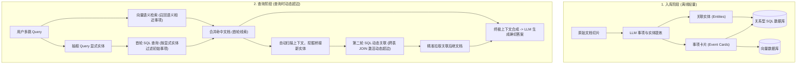

# 概念_SAG_动态超边结构化检索增强生成

## 定义与提出背景

**SAG（SQL-Retrieval Augmented Generation with Query-Time Dynamic Hyperedges，基于查询时动态超边的 SQL 检索增强生成）** 是由广州智跃深空（Zleap）开源提出的一种新型 RAG 检索架构。

在企业级私有知识库与智能体问答场景中，现有的主流检索架构面临两大极端困境：
1. **扁平向量 / 传统混合检索的“多跳断链”**：以 FastGPT、LangChain 等为代表的工业级检索方案（全文 + 向量 + 重排序）依赖相似度表征匹配。面对需要跨多篇独立文档推导的**多跳推理（Multi-hop Reasoning）**场景，若中间跳步的核心实体未出现在原始提问中，向量与全文召回必然发生线索截断；且传统分块大小与阈值调试如同“黑盒炼丹”，往往引发“提升覆盖率即引入大量噪音”的矛盾。
2. **全局图谱检索（GraphRAG / HippoRAG）的“离线重成本与维护枷锁”**：微软 [[concepts/概念_Graph_RAG_知识图谱增强检索|GraphRAG]] 或 HippoRAG 2 通过离线提取三元组建立全局知识网络，虽然具备强大的复杂多跳能力，但在文件入库阶段需耗费海量 LLM 调用构建静态全局图，不仅中等数据集构图开销巨大，且面对新文档增量入库或数据更新时，重新计算全局关系图谱的维护成本极高。

SAG 开创了第三条路径：**“文档入库结构化，图谱构建后推至查询时”**。利用经过工业界数十年验证的关系型 SQL 数据库作为底层，将静态离线大图替换为基于 SQL JOIN 的即时局部超边激活。

---

## 核心工作机制

### 1. 入库期：事项化建模取代机械切块
- **事项卡片（Event Cards）**：文档在入库时不采用 500/1000 字符的机械滑动窗口切分，而是调用 LLM 将内容切片重构为自包含的“事项卡片”（记录何时、何人发生了何种具体事件）；
- **实体抽取（Entities）**：同步提取事件涉及的人名、机构名、项目名等关键实体；
- **双库分离存储**：事项卡片存入向量库供语义搜索；事项元数据与实体关系存入 SQL 数据库，彻底避免切块割裂导致的语义截断。

### 2. 查询期：动态超边（Dynamic Hyperedges）与两轮隐式实体穿透
- **第一轮并行双轨召回**：
  - 向量引擎检索与 Query 意思最近的事项；
  - LLM 从用户提问中解析显式实体，通过 SQL 筛选第一批涉及该实体的事项；
- **桥接新实体自动捕获**：
  - 系统自动审查首轮命中的两份或多份文档，提取出**未出现在用户原始提问中**但作为内部桥梁连接节点的新实体（Bridge Entity）；
- **第二轮 SQL 动态 JOIN 激活**：
  - 以新实体为键，通过标准的 SQL `JOIN` 语句动态查出所有挂载该新实体的事项；
  - 将离散的多份文档拼合成完整的因果逻辑证据链，最终递交 LLM 生成确定性回答。

---

## 核心特性与对比优势

| 维度 | 传统混合检索 (FastGPT / 扁平 RAG) | 静态知识图谱 (GraphRAG / HippoRAG 2) | 动态超边检索 (SAG) |
| :--- | :--- | :--- | :--- |
| **多跳推理能力** | 极弱（中间无字面/语义重合即断链） | 强（沿全局图游走） | **极强（经 MuSiQue 验证达 80.04% SOTA）** |
| **构图成本** | 几乎为零（仅切块与 Embedding） | 极高（离线全量提取三元组，耗资巨大） | **低（仅入库抽取单篇事项卡，免全局构图）** |
| **增量维护开销** | 低（单篇追加） | 极重（新增文档易需全局重算社区/关系） | **极低（标准 SQL 增删改查行记录）** |
| **系统可解释性** | 黑盒模糊（调整向量分、重排阈值如炼丹） | 中等（图结构复杂，难以单点定位故障） | **白盒透明（完整的 SQL 执行与实体追溯日志）** |
| **底层向量模型依赖** | 高度依赖（模型弱则检索质量暴跌） | 中等偏高 | **极低（消融实验证明弱模型下精度依然稳定）** |
| **并发与数据规模** | 容易支持千万级 | 百万级易发生内存溢出 (OOM) 或延迟暴涨 | **已在 5 亿规模生产环境实现秒级延迟** |

---

## 评测数据表现 (Benchmark)

在学术界公认最具挑战性的多跳推理基准 **MuSiQue**（最多要求 4 跳组合推理且不可跳步）评测中：
- **SAG Recall@5 达 80.04%**；
- 领先于基于海马体索引与 Personalized PageRank 的 **HippoRAG 2（65.13%）近 15 个百分点**；
- 在 HotpotQA、2WikiMultiHop 等多跳基准上亦刷新了检索准确率指标。

在消融实验（Ablation Study）中：
- 将底层向量模型刻意降级替换为弱开源模型，传统高级 RAG 方案准确率骤降约 10%；
- SAG 则依靠确定性 SQL 实体约束把关，准确率稳定在 80% 左右。这意味着在拥有大量未见专业黑话的企业内部知识库中，SAG 无需针对向量模型进行特定微调即可高精度运转。

---

## 生产落地与工程架构实践

1. **确定性排障体系**：SAG 的调优过程脱离了传统 RAG 反复微调 chunk size 和重排阈值的“炼丹”，转化为清晰的软件工程排障：检查 LLM 抽取的实体是否完备 -> 检查同义词扩展表 -> 审查执行的 SQL JOIN 路径，工程师可精准定位并修补错误链。
2. **前后端架构解耦**：将 SAG 作为检索核心引擎，前端可无缝复用成熟的知识库产品（如 FastGPT），保留其权限分配、多租户鉴权与对话界面，由 SAG 提供高阶检索内核。
3. **Agent 的高确定性外部数据底座**：Agent 的自主规划本质上是多步推理（通过上一步的结论决定下一步行动）。通过 MCP（Model Context Protocol）协议将 SAG 封装为工具直接暴露给 [[entities/实体_Claude_Code|Claude Code]] 或 [[entities/实体_Codex|Codex]]，能够为本地 Coding Agent 提供无幻觉、确定可追溯的高质量上下文支撑。

---

## 关联概念与实体

- **关联概念**：
  - [[concepts/概念_Graph_RAG_知识图谱增强检索|概念_GraphRAG]]：全局离线预构建知识图谱范式。
  - [[concepts/概念_Graph_RAG_知识图谱增强检索|概念_知识图谱RAG]]：图结构多跳推理与构建成本权衡。
  - [[concepts/概念_RAG基础流程|概念_RAG基础流程]]：传统切分与混合检索基础流程。
  - [[concepts/概念_Lazy_Graph_RAG_惰性知识图谱增强检索|概念_Lazy_Graph_RAG]]：延迟图构建与混合索引降低成本路径。
- **关联实体**：
  - [[entities/实体_Claude_Code|实体_Claude_Code]]：可通过 MCP 工具挂载 SAG 作为多跳检索底座的 Coding Agent。
  - [[entities/实体_Codex|实体_Codex]]：支持 MCP 接入的本地智能体环境。

---

> 📎 **来源摘要**：
> - [[wiki/sources/再见RAG！AI知识库还得是SAG，又快又准～.md]]