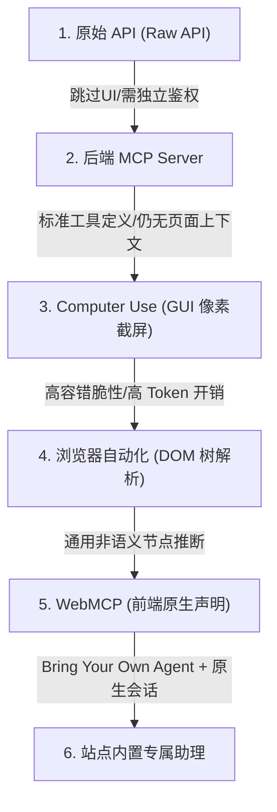

# 概念_WebMCP_浏览器原生工具协议

## 1. 定义与背景

**WebMCP** 是由 Google Chrome 与 Microsoft Edge 团队联合推动的浏览器原生 Web 标准 API。它旨在打破传统 Agent 依赖视觉截图（Computer Use）或逆向 DOM 解析（Browser Automation）操作网页的脆弱性，允许前端开发者直接在客户端代码中向接入浏览器的 AI Agent 显式声明网站所支持的操作（如搜索商品、加入购物车、预订时隙）、语义说明及入参 JSON Schema。

网页过去是专为人类视觉与点击交互设计的，缺少程序可读的机器动作接口。WebMCP 将“推测界面元素语义”的负担从 Agent 端卸载，转由网站自身显式声明其功能与参数约束。

---

## 2. Agent 触达应用的六种范式演进

在 Agent 与应用程序交互的光谱上，从“远离界面”到“贴近界面”存在六种典型技术路径：



| 范式 | 核心机制 | 优势 | 核心缺陷与局限 |
| :--- | :--- | :--- | :--- |
| **1. Raw API** | 直接通过脚本调用后端 HTTP/RPC 端点 | 精准、调用延迟低 | 开发者需手动维护 Endpoint 与 API Key，完全脱离网页前端环境 |
| **2. 后端 MCP Server** | 厂商自建 MCP 服务向外部暴露标准化 Tools | 工具语义明确，标准化程度高 | 跳过前端界面，无法复用浏览器已登录会话与实时 DOM 状态 |
| **3. Computer Use** | 截取屏幕画面，多模态模型定位按钮并模拟点击 | 零前置开发配置，理论适配任意界面 | 速度慢、Token 开销巨大、UI 布局微调即导致定位崩溃 |
| **4. 浏览器自动化** | 脚本遍历解析 DOM 结构与 HTML 属性 | 比纯像素可靠，无需依赖视觉推理 | 通用 HTML 缺乏统一语义，依然依赖启发式猜测（如匿名 div） |
| **5. WebMCP** | **浏览器原生 API 动态暴露强类型 Tools + JSON Schema** | **零前置配置、自带登录态、随状态动态呈现、界面实时可见** | 依赖现代浏览器试验性标准落地，生态处于早期 |
| **6. 站点内置助理** | 网站内嵌官方 Chatbot，厂商承担 Token 成本 | 界面深度定制，交互顺滑 | 强厂商锁定，用户无法接入自带 Agent（BYO Agent），记忆与上下文无法跨域流转 |

---

## 3. WebMCP 的核心设计优势

1. **确定性消除推测（Zero Guesswork）**：通过强类型 JSON Schema 约束输入参数，模型调用时不会出现因像素误判或 DOM 元素误点而静默执行错误操作。
2. **天然会话绑定（Session-bound Execution）**：工具在用户当前打开的浏览器标签页内执行，天然继承用户的登录态 Cookie 与权限认证，无需向外部 Agent 托管或传递敏感 API Key 与凭证。
3. **根据状态动态下发（Contextual Tool Discovery）**：工具列表随着页面状态与登录状态动态调整。例如：未登录访客仅可见搜索与商品详情浏览工具；用户登录后，浏览器自动向 Agent 暴露购物车管理、优惠券应用与结算下单工具。
4. **保持用户视觉在场（Visible UI Presence）**：工具执行直接触发网页已有交互逻辑，用户可在屏幕上实时观察到操作反馈，避免网站被降级为后台不可见的黑盒 API。
5. **模型通用互操作性**：基于标准 JSON Schema 定义入参规范，天然兼容 Claude、GPT、Gemini 等主流大模型 Function Calling 标准。

---

## 4. 接入与声明范式

### 4.1 JavaScript 编程式注册

在前端脚本中直接调用浏览器对象挂载工具，并复用页面已有业务函数：

```javascript
document.modelContext.registerTool({
  name: "add_to_cart",
  description: "将指定商品及购买数量添加到当前用户的购物车中",
  inputSchema: {
    type: "object",
    properties: {
      productId: { type: "string" },
      quantity: { type: "number" }
    },
    required: ["productId"]
  },
  async execute({ productId, quantity }) {
    // 直接复用网页现有购物车处理逻辑
    await addToCart(productId, quantity);
    return `成功添加 ${quantity} 件商品到购物车`;
  }
});
```

### 4.2 HTML 声明式属性扩展

对于现有的 HTML 表单，无需编写额外 JavaScript 代码，仅需扩充两个声明属性，浏览器将自动根据 `<input>` 字段推断构建入参 Schema：

```html
<form toolname="search_flights" tooldescription="根据出发地与目的地检索可用航班">
  <input name="from" placeholder="出发城市">
  <input name="to" placeholder="目的城市">
  <button type="submit">搜索</button>
</form>
```

---

## 5. 工程实测：表征改造对 Agent 性能的跃升

在开源桌面/浏览器自动化框架（如 WindTunnel 与 [[concepts/概念_Decision_Model_专用判断模型|专用判断模型]] 结合的场景）的实测对照中：
- **原始 DOM 控件表**：同一模型面对未优化的 DOM 时，任务完成率仅为 25/49，单步中位耗时为 5.4 秒；
- **切换到 WebMCP 结构化接口**：任务完成率立即跃升至 49/49（100%），中位耗时压缩至 3.2 秒。
- **工程启示**：端到端 Agent 的性能跃升中，**感知端输入表征的优化改造拉开了 44 个百分点的差距，远超过后端不同决策模型之间 3.8 个百分点的微小差距**。这证实了 WebMCP 原生暴露强类型结构化 Schema 对降低 Agent 推理歧义的决定性作用。

---

## 6. 关联概念与实体

- 关联概念：[[concepts/概念_MCP协议|概念_MCP协议]]（MCP 协议体系的浏览器端原生落地）
- 关联概念：[[concepts/概念_Agent_Skills元工具架构|概念_Agent_Skills元工具架构]]（Agent 工具层架构与可发现性）
- 关联概念：[[concepts/概念_MCP代码执行模式|概念_MCP代码执行模式]]（客户端工具调用与代码执行模式的演进对比）
- 关联概念：[[concepts/概念_Decision_Model_专用判断模型|概念_Decision_Model_专用判断模型]]（浏览器操作中感知、判断与执行三解耦架构）
- 关联实体：[[entities/实体_Jev|实体_Jev]]（动作判断模型评测基线）

---

## 7. 支撑来源

- [[wiki/sources/2026-08-31_WebMCP-by-Google,-clearly-explained!_1a0580f9aa7f67f1|wiki/sources/2026-08-31_WebMCP-by-Google,-clearly-explained!_1a0580f9aa7f67f1]]
- [[wiki/sources/更好的替代品早已存在，Jev 留给研究的只剩时机|更好的替代品早已存在，Jev 留给研究的只剩时机]]