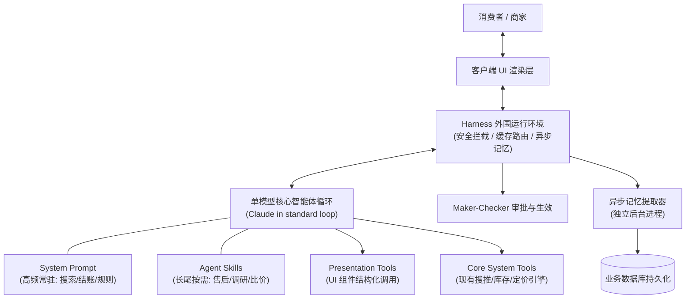

# 概念：电商智能体架构（Commerce Agent Architecture）

## 定义与核心特征

**电商智能体架构（Commerce Agent Architecture）** 是指专为简化线上商品选购、比价替换、组单履约及商家运营而设计的智能体系统工程范式。

与通用问答或开放性代码生成不同，电商智能体具备三大严苛的生产环境约束：
1. **高上下文耦合与长程会话**：单次购物会话横跨搜索、参数对比、意图澄清、加购与支付，涉及购物车状态、履约偏好及多轮历史的深度共享；
2. **极端的延迟敏感性**：面向消费者的购买界面任何等待卡顿都会直接折损结算转化率；
3. **高危的资金与业务操作**：价格修改、发货、退款与订单确认具有不可逆性，绝不能依赖概率性 Prompt 约束。

Anthropic 基于大量企业落地实践提出了标准电商智能体架构体系。

---

## 核心架构支柱

### 1. 单模型结合技能架构（Skills over Subagents）
传统架构常倾向于为每一个业务域（如搜索、比价、退款、推荐）各部署一个子智能体（Subagent）。在电商场景中该做法被证实为负优化：
- **交接状态损耗（State-lossy Handoff）**：主调度器与子代理间的切换会丢失大量微观上下文与偏好，使智能体回复质量急剧下滑；
- **延迟与成本陡增**：多次上下文打包和转交产生巨量冗余 Token，增加数秒时延；
- **推荐架构**：采用**单一核心智能体配合 Agent Skills**。按出现频率划分知识：覆盖 $\ge 1/3$ 流量的核心逻辑常驻系统提示词，其余长尾业务规程作为 Skill 在运行时按需注入，既保障全局上下文零损耗，又避免系统提示词超载。

### 2. 工具工程：基于既有系统与上下文精简
- **封装既有系统而非重构**：企业已有高度优化的搜索排序、库存分配与动态调价服务。智能体工具应作为其上层轻量客户端，智能体专注于目标理解与最终展现，避免在工具代码中拼装复杂的领域业务逻辑；
- **工具结果即上下文（Tool Results are Context）**：工具返回必须剔除与模型推理无关的高冗余数据（如大量图片 URL），并将错误转化为包含下一步修正提示（Error Instructions）的指导性信息。

### 3. [[concepts/概念_Presentation_Tools_表现层工具化|表现层工具化（Presentation Tools）]]
将富交互 UI 组件（商品轮播、行程表、方案对比）全部抽象为带类型的工具。由服务端统一进行 Schema 校验、业务数据灌装与事件推送，工具入参自然留存在上下文消息中，使智能体原生支持用户基于屏幕相对方位的空间指代。

### 4. 双前线延迟与成本优化
- **端到端延迟（Task Completion Latency）**：
  - **Fewer Turns**：前置首屏上下文，提升基座模型规划智能，并行调用独立工具；
  - **Faster Tools**：统一后端聚合接口，采用急切工具分派（Eager Tool Dispatch）随参数流式生成即刻执行；
  - **Faster Tokens**：通过 Eval 评测集扫参平衡智能与生成速度；
- **感知延迟（Perceived Latency）**：流式推送组件分片，并实时输出自然语言执行步骤（Show the Work）；
- **三段式提示词缓存（Prompt Caching）**：严格保持 Global 前缀字节级恒定，隔离 Session 历史与末尾 Volatile 挥发数据，将技能以 Tool 结果形式载入并动态前滚断点，实现 90%~99% 缓存命中。

### 5. 异步三层记忆体系
记忆属于受监管的结构化数据，应保存在企业关系数据库中，严禁仅以扁平 Markdown 维护。
- **异步提取写**：由独立后台进程在会话结束后读取纯对话文本进行事实抽取，不侵占前台交互响应时间，杜绝第三方商品详情污染用户画像；
- **三层按需读**：核心参数常驻上下文，会话触发时按需预取，长尾冷数据由智能体自主调用工具查询。

### 6. 外围 Harness 确定性安全门禁
- **提案与生效分离（Staging & Apply）**：模型仅能生成 Staging 暂存提议，资金划拨与订单变更必须经由 Harness 外部的人工确认（Maker-Checker）或确定性规则生效；
- **服务端 ID 白名单**：模型提交的写操作与渲染仅接收服务端在当前 Session 内签发的有效 ID，拒绝一切未经读取凭空生成的幻觉或注入标识；
- **三方数据净化隔离**：商品评论、商家政策等第三方输入全量通过 Sanitizer 清洗特殊控制符，包裹固定隔离围栏，限制其仅作为内容参考而非执行指令。

---

## 关联

- [[concepts/概念_Presentation_Tools_表现层工具化]]
- [[concepts/概念_上下文工程]]
- [[concepts/概念_Agent三层记忆体系]]
- [[concepts/概念_Agent系统化工程]]
- [[concepts/概念_Agent_Skills元工具架构]]
- [[entities/实体_Anthropic]]
