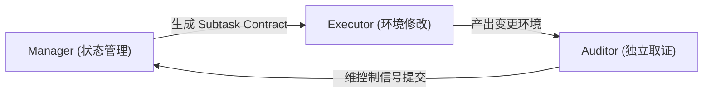

# 实体：LongHorizon-Harness

## 基本信息

- **项目全称**：LongHorizon-Harness (`lh-harness`)
- **开发团队**：阿里巴巴高德团队（AutoNavi / Amap）
- **项目定位**：面向数小时复杂长任务的智能体事务协调与外层编排框架（Outer Submission Protocol / Transaction Coordinator）
- **开源主页**：[https://lh-harness.pages.dev/](https://lh-harness.pages.dev/)
- **核心模式**：Manage-Execute-Audit (MEA) 审计状态机循环

### 安装与启动命令

```bash
uv tool install lh-harness
lh-harness doctor
lh-harness init
lh-harness run --task @task.md --agent codex --dashboard
lh-harness web --workspace-root .
```

---

## 核心架构：Manage-Execute-Audit (MEA) 三角色解耦

传统 Agent 往往将执行（Tool Use）、状态维护（History Summary）与终局判断（Self Evaluation）全部耦合在同一个逐渐膨胀的会话中，导致 Compounding Errors、Goal Drift 与 [[concepts/概念_Context_Rot|Context Rot]]。LongHorizon-Harness 将长任务重新定义为**任务状态管理问题**，把系统解耦为三个结构隔离的角色：



1. **Manager（状态管理者）**：
   - 持有原始任务、全局状态账本和累计审计报告；
   - **严格无环境操作权限**：不能直接读取工作区、点击 GUI 或运行 Shell；
   - 职责是动态评估剩余需求，生成每轮只包含原子范围的子任务契约（Subtask Contract）。
2. **Executor（环境改变者）**：
   - 系统中**唯一允许主动改变环境**的角色；
   - 每一轮均在全新的、受预算限制的独立上下文运行，通过 `AgentAdapter` 驱动 [[entities/实体_Claude_Code|Claude Code]] 或 [[entities/实体_Codex|Codex]] 执行具体编码或桌面操作；
   - 本轮结束后其高噪声原始轨迹丢弃，不污染后续推理。
3. **Auditor（只读独立验证者）**：
   - 接收契约与 Executor 声明，但**不查看 Executor 的中间推理过程与高噪声轨迹**；
   - 仅具只读权限，从外部物理环境重新采集真实证据（查看文件、读取端口/进程、无副作用命令），防范自评虚假完成；
   - 给出三维控制行（Completion Status / Integrity Status / Contract Audit）。

---

## 任务状态账本（Task State Ledger）

LongHorizon-Harness 的任务状态非模糊对话历史，而是显式结构化记录集合：
- **Requirement**：从原始需求分解出的目标与硬约束；
- **Artifact**：执行过程中生成的物理交付物（文件、配置、镜像）；
- **Fact**：后续轮次需要使用的确切环境事实（端口号、依赖版本等）。

每条记录均绑定状态（`completed` / `pending` / `blocked` / `untrusted`）与审计证据链接。只有 Auditor 验证通过后，Manager 才能更新账本。

---

## 与 Claude Code、Codex 的外层包裹定位

LongHorizon-Harness 并非 Claude Code 或 Codex 的替代品，而是处于外层“事务协调面”：

| 维度 | 原生 Coding Agent (Claude Code / Codex) | LongHorizon-Harness (MEA) |
| :--- | :--- | :--- |
| **系统定位** | 具备完备 Tool Loop 的单轮/交互式执行引擎 | 包裹底层 Agent 的外层状态机与长任务编排层 |
| **推理依据** | 会话历史、Compaction、Rules、Auto Memory | 原始任务、受审计状态账本、本轮契约与审计报告 |
| **上下文管理** | 会话逐渐膨胀，靠自动压缩或 Subagent 缓解 | 轮间上下文强制重置（Fresh Context per Turn） |
| **完成判定** | 当前 Agent 自行判断或依靠一次性 Review 建议 | Auditor 作为必须前置守卫，三维信号硬性裁决 |
| **恢复机制** | 基于编辑撤销或 Git 恢复代码 | 状态账本记录可信基线，支持外部非代码状态单调向前推进 |

---

## 关联概念与来源

- **关联概念**：
  - [[concepts/概念_Harness_Engineering|概念_Harness_Engineering]]
  - [[concepts/概念_Agent内存与状态管理|概念_Agent内存与状态管理]]
  - [[concepts/概念_Context_Rot|概念_Context_Rot]]
  - [[concepts/概念_上下文工程|概念_上下文工程]]
- **支撑来源**：
  - [[wiki/sources/阿里高德 LongHorizon-Harness 框架：使用审计状态机重构Agent执行流程.md]]
