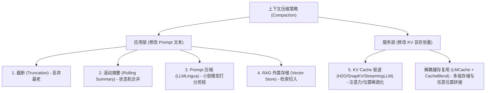

# 来源摘要：5 context compaction strategies for LLM agents

## 来源信息

- **原文标题**：5 context compaction strategies for LLM agents
- **通讯来源**：Daily Dose of DS
- **原邮件主题**：Build a Multi-Agent GTM Intelligence System
- **发送作者**：Daily Dose of DS (Avi Chawla) `<avi@dailydoseofds.com>`
- **发布日期**：2026-08-25
- **邮件/文章标识**：`1a03a9b5c46e28a5:2`
- **关联开源项目**：[LMCache](https://github.com/LMCache/LMCache)

---

## 核心要点（Executive Summary）

1. [原文陈述] **上下文压缩的成本倒挂悖论（The Compaction Cost Paradox）**：压缩 Agent 上下文虽然削减了 Token 绝对数量，但在前缀缓存（Prefix Caching）机制下反而可能大幅推高账单费用。原因在于 Token 数量与计费计价依据并不等同。
2. [原文陈述] **尾部追加（Tail-append）与前部编辑（Head-edit）的计费差异**：未压缩的单长会话每次调用都全量重发历史，尾部追加模型回复与工具输出；由于前面绝大部分 Token 序列字节级完全一致，云厂商将其计为 Cache Read（如 Anthropic 仅收取基础输入费率的 10%），因此上下文即使极度膨胀也维持低单次成本。相反，压缩操作编辑的是对话历史前部（用摘要替换原始轮次），导致编辑点之后的前缀哈希彻底失效，迫使云厂商将原本属于低成本 Cache Read 的 10K 摘要按 Cache Write（如 1.25 倍基础费率）重新写入计费。
3. [原文陈述] **重复触发重置经济模型**：尽管单次压缩后的写入成本可在随后的连续调用中通过重新建立的 Cache Read 摊薄，但由于 Agent Harness 通常按固定的 Token 阈值触发压缩，长会话的周期性触发会导致系统不断经历“缓存重置与高费率重写”。
4. [原文陈述] **业界通用的五种上下文压缩策略分类**：
   - **截断（Truncation）**：硬丢弃最老轮次的 Token。实现成本最低，但会永久丢失早期决策与上下文约束。
   - **滚动摘要（Rolling Summarization）**：将新增内容持续合并入持久化摘要状态而非从头生成，但每次合并都会移动前缀缓存边界。
   - **提示词压缩（Prompt Compression）**：借助小型编码器模型为 Token 重要性打分并剔除低相关性 Token。如 LLMLingua 在极小精度损失下实现高达 20 倍压缩，LLMLingua-2 采用 BERT 规模编码器打分。
   - **基于 RAG 的检索式注入（RAG-based Retrieval）**：将历史转存至向量数据库，仅依据当前 Query 检索注入相关片段，将长上下文退化问题转化为检索精度（Retrieval Precision）问题。
   - **KV Cache 驱逐（KV Cache Eviction）**：发生在推理服务层，根据注意力分数（如 H2O、SnapKV）或位置（如 StreamingLLM）剔除最不可能被访问的 KV 张量条目。
5. [原文陈述] **有损文本删除 vs 无损张量卸载/复用**：前三类策略属于永久删除文本，RAG 属于外置存储；而服务端 KV Cache 驱逐不改变输入文本本身，丢弃的张量随时可由 GPU Prefill 重新推导。LMCache 通过将超出 GPU 显存的 KV 块卸载至 CPU DRAM、本地 NVMe 或远端存储，并借助 CacheBlend 算法实现 Prompt 任意位置的非连续缓存块复用。

---

## 关键机制深度拆解

### 1. Prefix Caching 下的成本倒挂反转机理

考虑一个拥有 100K 历史 Token 的长期会话：

| 方案 | 计费模式 | 计费单价换算（以 Anthropic 为例） | 等效全价 Token 成本 |
| :--- | :--- | :--- | :--- |
| **方案 A：不压缩（纯尾部追加）** | 100K Token 命中 **Cache Read** | $0.10 \times \text{Base Price}$ | **10K Tokens 全价当量** |
| **方案 B：压缩至 10K 摘要** | 10K Token 触发 **Cache Write**（前缀断裂重新落盘） | $1.25 \times \text{Base Price}$ | **12.5K Tokens 全价当量** |

> **反直觉结论**：Token 数量减少到了原本的 $\frac{1}{10}$，但单次调用的实际账单金额反而增加了 **25%**。若频繁触发 Compaction，账单成本将显著高于维持长窗口尾部追加。

### 2. 五种上下文压缩策略全景横向对比

| 策略类别 | 代表实现 / 技术 | 作用层级 | 信息损失性质 | 对 Prefix Cache 的影响 | 核心失效模式 |
| :--- | :--- | :--- | :--- | :--- | :--- |
| **1. 截断 (Truncation)** | 滑动窗口截断 | 应用层 (Prompt) | 永久物理丢失最老上下文 | 每次前缀失效，破坏缓存连续性 | 关键初始需求与早前设定丢失 |
| **2. 滚动摘要 (Rolling Summary)** | LangChain / Claude Compaction | 应用层 (Prompt) | 语义有损抽象（细节丢失） | 每次更新摘要均重置缓存起点 | 随着多轮迭代摘要出现细节稀释与幻觉 |
| **3. 提示词压缩 (Prompt Compression)** | LLMLingua / LLMLingua-2 | 应用层 (Prompt) | Token 级有损删词（最高20x） | 删词改变 Token 序列，无法命中前缀缓存 | 偶发丢失关键指令词与语法完整性 |
| **4. RAG 外置检索 (RAG-based)** | Vector Store + 相似度检索 | 应用层 (外部外置) | 文本保留于外置存储，上下文按需注入 | 每次检索召回结果不同导致前缀彻底离散 | 检索漏召回（Precision/Recall 瓶颈） |
| **5. KV Cache 驱逐 (Eviction)** | H2O, SnapKV, StreamingLLM | 服务层 (KV 显存) | 无损文本，仅丢弃 GPU 算好的张量（可重算） | 仅在支持 KV 稀疏引擎内部生效 | 显存节省但可能增加局部重算延迟 |

### 3. LMCache 的 CacheBlend 任意位置缓存复用

传统 Prefix Caching 严格受限于“公共前缀必须从第 0 个 Token 连续字节匹配”。一旦应用层在 Prompt 头部或中部插入压缩摘要、不同顺序的 RAG 文档，整条前缀缓存全部报废。
- **解耦式多级存储**：超出的 KV Cache 张量下沉至 CPU DRAM、NVMe 或远程存储，消除显存溢出风险；
- **CacheBlend 选择性重计算**：利用 Transformer 注意力局部性，仅针对文档或模块拼接边界有跨越交互的极少数 Token 执行重计算，内部 Token 直接复用既有 KV 块，使前缀缓存不再受限于“严格单调头部匹配”，打通了 Agent 上下文压缩与前缀缓存复用之间的冲突死锁。

---

## 关联概念与实体

- **关联概念**：
  - [[concepts/概念_上下文工程|概念_上下文工程]]：包含 Reduce（压缩）与 Offload（卸载）的核心方法论。
  - [[concepts/概念_Prompt_Compression_提示词压缩|概念_Prompt_Compression]]：包含 LLMLingua / LLMLingua-2 等基于小型编码器打分的 Token 剪枝技术。
  - [[concepts/概念_KV_Cache_键值缓存|概念_KV_Cache]]：大模型推理显存与自回归生成的核心加速结构。
  - [[concepts/概念_LMCache_解耦式KV缓存|概念_解耦式KV缓存与LMCache]]：CacheBlend 跨位置缓存块复用与分层卸载架构。
  - [[concepts/概念_Context_Rot_上下文衰退|概念_Context_Rot]]：长上下文性能衰减现象，触发 Compaction 的核心动因。
- **关联实体**：
  - [[entities/实体_Anthropic|实体_Anthropic]]：Prompt Caching 差异化计费规范制定者（10% Read vs 125% Write）。

---

> 📎 **物理文献**：[[raw/articles/2026-08-25_5-context-compaction-strategies-for-LLM-agents_1a03a9b5c46e28a5.md]]
