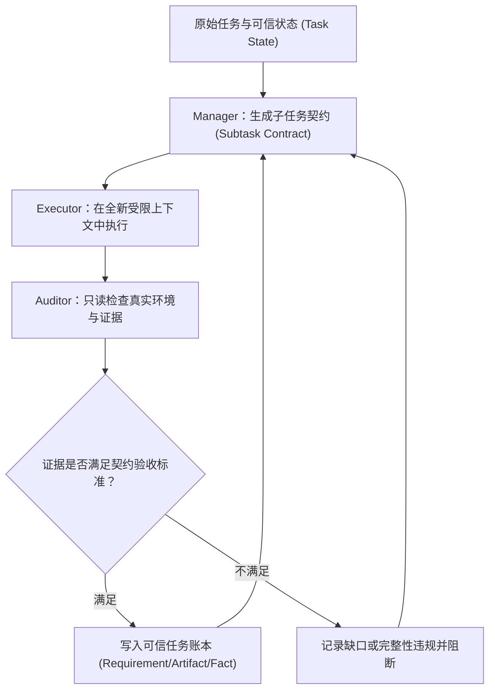

# 来源摘要：阿里高德 LongHorizon-Harness 框架：使用审计状态机重构Agent执行流程

## 来源信息

- **原文标题**：阿里高德 LongHorizon-Harness 框架：使用审计状态机重构Agent执行流程
- **发布作者**：[[entities/实体_Coggle|Coggle数据科学]]
- **发布时间**：2026-08-26
- **原文链接**：[微信公众号原文](https://mp.weixin.qq.com/s/hPR4uXPs_5sD9-2i3lG_eQ)
- **开源主页**：[https://lh-harness.pages.dev/](https://lh-harness.pages.dev/)
- **核心项目**：[[entities/实体_LongHorizon-Harness|LongHorizon-Harness (lh-harness)]]（阿里高德团队开源）

---

## 核心要点（Executive Summary）

1. [原文陈述] **长任务本质是任务状态管理问题而非上下文窗口容量问题**：传统 Agent Harness 将执行过程、任务记忆和完成判断置于单一不断增长的会话中；长任务中由于信息密度持续下降，即使未达上下文上限也会出现严重检索与推理退化（Context Rot），早期误差被当作事实引发滚雪球偏差（Compounding Errors 与 Goal Drift），并因缺乏显式环境证据导致任务状态丢失（Task-State Loss）。
2. [原文陈述] **从“轨迹中心”转向“审计状态转换中心”**：传统单会话将任务视为渐长的动作-观察轨迹（$a_t, o_t$）；LongHorizon-Harness 转向经审计的环境状态转换，不强求保留所有历史动作，核心只回答三个问题：当前有哪些可信事实、本轮允许改变什么、改变后环境是否真满足验收条件。
3. [原文陈述] **Manage-Execute-Audit (MEA) 三角色结构隔离**：
   - **Manager（状态管理者）**：仅管理由 Requirement（需求/约束）、Artifact（交付物）、Fact（环境事实）构成的三元组任务状态，无环境直接操作权限，负责依据累计审计报告生成受约束的子任务契约（Subtask Contract）。
   - **Executor（环境改变者）**：唯一被允许主动改变环境的角色，每一轮都在受预算限制的全新、纯净上下文中运行，区分 GUI 与 CLI 执行器；完成本轮后原始执行轨迹丢弃，不作为下一轮推理上下文。
   - **Auditor（只读独立验证者）**：仅具只读观察权限，重新读取文件、检查界面或执行无副作用只读命令进行独立取证，输出任务状态（complete/incomplete/blocked）、完整性状态（clean/suspect/violation）与契约审计（aligned/unknown/needs_revision/invalid）三维审计报告。
4. [原文陈述] **子任务契约（Subtask Contract）平衡动态分解与固定计划**：预先全量生成 DAG 难以应对未知报错，完全反应式执行则缺乏全局约束；契约每轮只承诺一个可审计的局部转换，允许动态改道但不允许动态降低验收门槛。
5. [原文陈述] **外层事务协调层定位而非替代 Claude Code 或 Codex**：LongHorizon-Harness 并非重新实现代码搜索、Shell 或内部 Tool Loop，而是通过 `AgentAdapter` 把 [[entities/实体_Claude_Code|Claude Code]] 或 [[entities/实体_Codex|Codex]] 作为某一轮的执行引擎；底层 Agent 负责把单轮工作做出来，MEA 外层循环负责判断哪些结果有资格累积进长期可信进度。
6. [原文陈述] **从最后可信状态恢复而非回滚世界**：在长生命周期中服务进程与外部 SaaS 状态无法完全回退，Harness 运行账本记录失败后哪些事实仍然可信、哪些需要重做，实现从最后可信进度继续向前。

---

## 关键机制深度拆解

### 1. 传统单会话 Harness 的三重耦合弊端

传统 Agent Loop 存在严重的结构性耦合：
- **执行与状态维护共享上下文**：模型一边操作环境，一边在当前会话中用自然语言记录历史，导致 Context Rot 与噪声污染；
- **执行与完成判断共享主体**：模型既是考生又是阅卷人，只要模型自认“看起来已完成”，系统就可能提前退出，缺乏确定性物理验证；
- **误差自增强**：早期一次错误总结一旦进入历史，后续轮次便将其作为事实基底展开，引发不可逆的 Goal Drift。

```
传统模式：
  [模型执行] ──> [写入自身历史总结] ──> [基于同一历史决策] ──> [自行宣布完成] (高风险)

LongHorizon-Harness MEA 模式：
  [Manager 生成契约] ──> [Executor 纯净上下文执行] ──> [Auditor 独立物理取证] ──> [写入可信状态账本]
```

### 2. MEA 循环协同流转



### 3. 三维审计报告控制行

Auditor 的审查结果非二元“通过/不通过”，而是输出三维控制信号，构成严格的状态流转守卫：

| 维度 | 可选枚举值 | 核心评估问题 |
| :--- | :--- | :--- |
| **Completion Status** | `complete` / `incomplete` / `blocked` | 本轮子任务契约中规定的物理验收条件是否已完全满足 |
| **Integrity Status** | `clean` / `suspect` / `violation` | 取证过程与交付产物是否真实可信，审计动作是否污染了环境 |
| **Contract Audit** | `aligned` / `unknown` / `needs_revision` / `invalid` | 本轮执行合同是否仍然忠实覆盖原始总体任务与硬约束 |

### 4. 与 Claude Code、Codex 的分工与选型矩阵

- **几十分钟至一两小时、单代码库、可通过测试/Lint/Diff 表达的任务**：优先直接使用 Claude Code 或 Codex，无需额外引入外层编排；
- **数小时、跨 GUI/CLI/服务状态、不可逆先后依赖、易发生虚假完成的长期任务**：使用 LongHorizon-Harness 包裹 Claude Code / Codex，由外层进行状态沉淀与证据把关。

---

## 关联实体与概念

- **关联实体**：
  - [[entities/实体_LongHorizon-Harness|实体_LongHorizon-Harness]]：阿里高德开源的审计状态机驱动长时 Agent 编排框架。
  - [[entities/实体_Claude_Code|实体_Claude_Code]]：可作为 Executor 被 MEA 外层包裹的原生 Coding Agent。
  - [[entities/实体_Codex|实体_Codex]]：可作为 Executor 被 MEA 外层包裹的工程 Agent 平台。
  - [[entities/实体_Coggle|实体_Coggle]]：技术解读与分析报告发布方。
- **关联概念**：
  - [[concepts/概念_Harness_Engineering_宿主编排工程|概念_Harness_Engineering]]：LongHorizon-Harness 代表的外壳工程与长任务状态提交范式。
  - [[concepts/概念_Context_Rot_上下文衰退|概念_Context_Rot]]：长时交互中信息稀释与推理退化的物理机制。
  - [[concepts/概念_Agent内存与状态管理|概念_Agent内存与状态管理]]：状态（State）与记忆（Memory）解耦及任务账本沉淀机制。
  - [[concepts/概念_上下文工程|概念_上下文工程]]：通过轮间上下文重置与隔离（Isolate）遏制噪声膨胀。

---

> 📎 **物理文献**：[[raw/articles/阿里高德 LongHorizon-Harness 框架：使用审计状态机重构Agent执行流程.md]]
